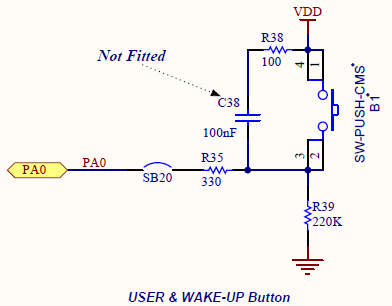
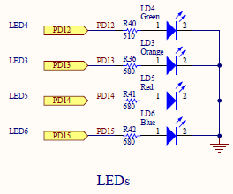

Lab 05: Programming for EXTI0 Interrupt 
====================================

# Objective
The objective of this lab is to learn programming of EXTI0 interrupt of the microcontroller STM32F4xx.

# Description
In this project we will learn programming of the external interrupt EXTI0 of the microcontroller STM32F407. We select the pin PA0 as the external interrupt input. We should complete two interrupt tests with programming in C language: 

  1) using the blue button on board to generate interrupt input signal and control the LED turning on and off in sequence; and 

  2) using the PD12, or GPIOD-pin12 as the digital output to generate interrupt input signal so that we can measure the response time of the interrupt handler.

In the test 1), the blue button of the evaluation kit STM32F4Discovery is used to generate the input of PA0. The circuit scheme of the blue button of STM32F4Discovery kit is shown in Fig. 1. If there is no other voltage signal connected to the pin PA0 directly, the status of the PA0 input is dependent on the button status. When the button is released, the input PA0 is zero voltage level, or logic 0. When the button is pressed, the input PA0 is 1 high voltage level, or logic 1. PA0 is configured as interrupt EXT0 input. The input rising edge will trigger an interrupt.

In the test 2) the output PD12, or GPIOD-pin12, is connected to PA0. PD12 is programmed to generate pulse periodically which is input to PA0 to generate interrupt. The interrupt service routine for EXTI0 is to toggle the output of the pin PD13 (GPIOD-pin13). By measuring the time delay from the rising edge of PD12 to the rising/falling edge of PD13 with an oscilloscope we can obtain the response time of the interrupt service routine.


   
Fig. 1 the circuit scheme of the blue button and LEDs


# Procedure

1.	Open your peripheral project Lab4a created in Lab4a:
Before any modification, keep the backup of the original files main.c, main.h, stm32f4xx_it.c and stm32f4xx_it.h by saving these files as main_ori.c, main_ori.h, stm32f4xx_it_ori.c and stm32f4xx_it_ori.h
2.	Modify the source module main.c for the first test:

     - Remove the content within the body of within while(1) loop in the function void main(void).
     - Before while(1) loop, insert the following line to configure for the button interface: 
     ```cpp
     STM_EVAL_PBInit(BUTTON_USER, BUTTON_MODE_EXTI);
     ```

     - Add a function in the main module
     ```cpp
      void ButtonISR(void){
          switch (Button_count)
       {
      case 0:
            GPIO_SetBits(GPIOD, GPIO_Pin_12);
            break;
      case 1:
            GPIO_ResetBits(GPIOD, GPIO_Pin_12);
            GPIO_SetBits(GPIOD, GPIO_Pin_13);
            break;
      case 2:
            GPIO_ResetBits(GPIOD, GPIO_Pin_13);
            GPIO_SetBits(GPIOD, GPIO_Pin_14);
            break;
      case 3:
            GPIO_ResetBits(GPIOD, GPIO_Pin_14);
            GPIO_SetBits(GPIOD, GPIO_Pin_15);
            break;
      default:
            GPIO_ResetBits(GPIOD, GPIO_Pin_12|GPIO_Pin_13|GPIO_Pin_14|GPIO_Pin_15);
       }
      if (Button_count++ > 4) Button_count = 0;
      }
      ```

      - Add a private variable in the source module main.c
      ```cpp 
      uint16_t Button_count = 0;
      ```
      - Add the prototype of function void ButtonISR(void); in the head file stm32f4xx_it.h


3.	Modify the source code module stm32f4xx_it.c
In the source module stm32f4xx_it.c, modify the interrupt service routine for EXTI0 as:
```cpp
void EXTI0_IRQHandler(void)
{   
    EXTI_ClearFlag(EXTI_Line0);
    ButtonISR();
}
```

4.	Add two source code files stm32f4xx_exti.c and stm32f4xx_syscfg.c from the folder 
..\stsw-stm32068\STM32F4-Discovery_FW_V1.1.0\Libraries\STM32F4xx_StdPeriph_Driver\src 
into the group STM32F4xx_StdPeriph_Driver of the project IO_Toggle.

5.	Rebuild, Download and Debug your project:
After running the program, you may press the blue button to turn on and off of four LEDs one after another.

6.	Modify the source module main.c for the second test:
	- Before modification you may want to save a backup of main.c for the first test as main_test1.c.
	- In the body of while(1) loop of the main funciton, add the following code:
       ```cpp
       GPIO_SetBits(GPIOD, GPIO_Pin_12);
       Delay(0x3FFFFF);
       GPIO_ResetBits(GPIOD, GPIO_Pin_12);
       Delay(0x3FFFFF);
       ```

	- Modify the function void ButtonISR(void) as:
      ```cpp
      void ButtonISR(void)
      { 
       GPIO_ToggleBits(GPIOD, GPIO_Pin_13);
      }
      ```

7.	Rebuild, Download and Debug your project:
Before running the function, you should connect PD12 to PA0 and use two probes of an oscilloscope to measure the signals at PD12 and PD13 simultaneously. After running the program, you can watch the waveforms of both signals with the oscilloscope. The time delay from the edge of PD12 to the edge of PD13 is the response time of the interrupt handler. Assuming that system clock is 168 MHz, find the number of cycles corresponding to the time delay.

   **Delay time = 272 ns	           Number of system cycles = 45**


Report:
1.	Submit your source code main.c for both tests.
2.	Understand the function 
STM_EVAL_PBInit(BUTTON_USER, BUTTON_MODE_EXTI);
The function can be found in the source code module stm32f4_discovery.c. 
As the part of the report, you should provide description of the features, configuration of NVIC and EXTI controller of the function.


The two arguments to STM_EVAL_PBInit are defined and initialized as:

- BUTTON_USER which is initialized to 0
- BUTTON_MODE can have one of the following two values:
  - BUTTON_MODE_GPIO: Button will be used as simple IO and is initialized as 0
  - BUTTON_MODE_EXTI: Button will be connected to EXTI line with interrupt generation capability and is initialized as 1


When the BUTTON_USER is initialized to BUTTON_MODE_EXTI, the following EXternal Interrupt configurations are set up: 
- NVIC_IRQChannel: Defines the Button EXTI interrupt as the interrupt to set settings for 
- NVIC_IRQChannelPreemptionPriority: The Button EXTI interrupt is set to the lowest priority.
- NVIC_IRQChannelSubPriority: With Interrupt of the same type, the Button EXTI is assigned the lowest sub priority. 
- NVIC_IRQChannelCmd: The Button EXTI interrupt is enabled 


Otherwise, the Button is used as a GPIO input.


